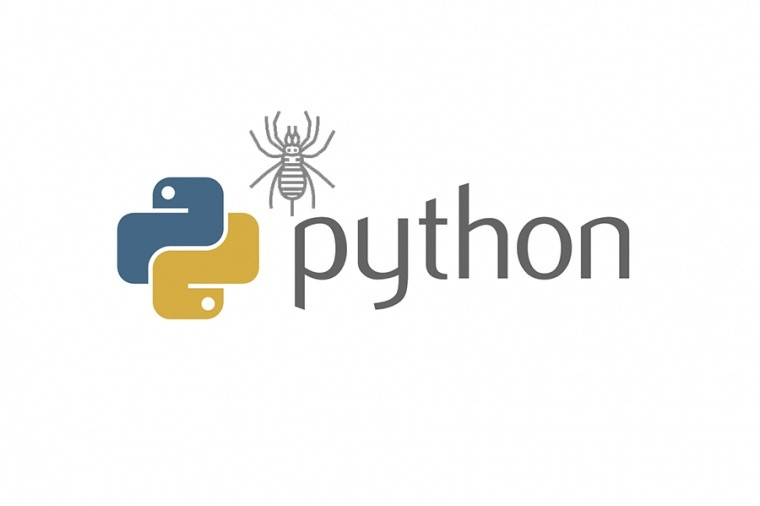
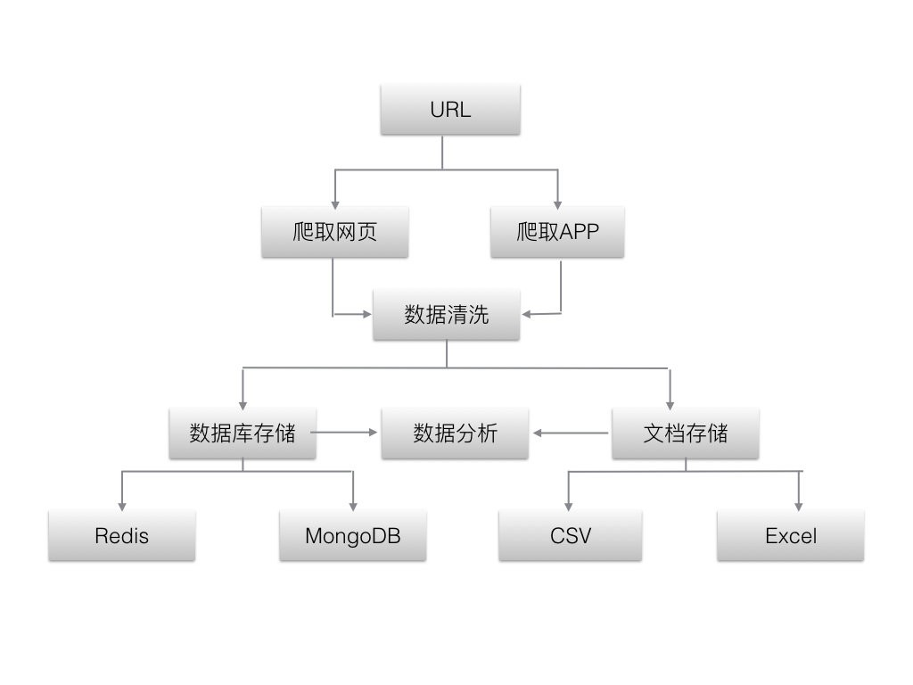

# 网络爬虫的基本概念和认知



图片来源于网络


## 1. 爬虫的定义

> 网络爬虫（又称为网页蜘蛛，网络机器人，在 FOAF 社区中间，更经常的称为网页追逐者），是一种按照一定的规则，自动地抓取万维网信息的程序或者脚本。另外一些不常使用的名字还有蚂蚁、自动索引、模拟程序或者蠕虫。—— 百度百科定义 [详细定义参照](https://baike.baidu.com/item/网络爬虫/5162711?fr=aladdin)

**慕课网注解：**  爬虫其实是一种自动化信息采集程序或脚本，可以方便的帮助大家获得自己想要的特定信息。比如说，像百度，谷歌等搜索引擎，他们的背后重要的技术支撑就是爬虫。当我们使用搜索引擎搜索某一信息的时候，展现在我们眼前的搜索结果，就是爬虫程序事先从万维网里爬取下来的。我们之所以称之为爬虫，只不过是对自动获取万维网的动作的形象比喻而已。


## 2. 爬虫的流程架构

爬虫大致的工作流程如下图所示：首先获取数据，然后对数据进行清洗和处理，最后对数据进行持久化存储，以及后面的数据可视化工作。后面的章节中，我们会按照这个流程，详细的一一介绍。
 

​        爬虫流程架构图


## 3. 爬虫的分类

爬虫按照系统结构和实现技术，大致可以分为以下几种类型：


### 3.1 通用网络爬虫(General Purpose Web Crawler)

通用爬虫，主要是指谷歌，百度等搜索引擎。它们爬取的范围广，种类多，存储的信息量大，对技术的要求比较高。


### 3.2 聚焦网络爬虫(Focused Web Crawler)

聚焦爬虫，主要是根据特定的主题进行爬取。这是大家最长使用的爬虫种类。比如，我们爬取金融类的，或者电影，图书之类的特定信息。由于我们限定了主题和网站，可以极大的节省我们的硬盘和网络资源，更好的满足特定业务的需求。


### 3.3 增量式网络爬虫(Incremental Web Crawle)

增量爬虫，主要是指我们在周期性的爬取一些网站的时候，只是仅仅爬取网站变更的内容，而不是把所有网站数据重新爬取一遍。这样，可以有效的降低运维成本。


### 3.4 深层网络爬虫(Deep Web Crawler)

深层网络爬虫，主要是指我们不能直接爬取的一些网站。比如，这些网站需要用户登陆，或者填写一些特定的表单，才能继续深入爬取信息。

> **Tips :** 其实在实际的项目中，我们通常会将两种甚至多种爬虫技术相结合来使用，以达到更好的效果。


## 4. 爬虫的抓取策略

爬虫根据业务需求的不同可以大致分为两种不同的抓取策略：


### 4.1 深度优先策略

深度优先策略是指爬虫在爬取一个 HTML  页面的时候，如果发现页面中有新的 URL，将对这个新的 URL 进行深度优先搜索，以此类推，一直沿着 URL  进行爬取，直到不能深入为止。然后，返回到上一次的 URL 地址，寻找其他 URL 进行搜索，当页面中没有新的 URL  可以供选择的时候，说明搜索已经结束。

举一个简单的例子，比如，我们访问慕课网，假设慕课网首页只有两个课程链接，一个是爬虫课，另一个是 Python  课，深度优先算法就是先进入到爬虫课中，然后再进入到爬虫课的一个章节链接中，如果这个章节里没有了子章节，爬虫就会退到上一层，从另一个没有访问过的章节继续访问，所有章节都访问完了，爬虫会退回到首页，对 Python 课链接也执行相应的搜索，直到无法找到新的 URL 进行搜索而结束。


### 4.2 广度优先策略

广度优先策略是指爬虫需要爬取完整个 web 页面的所有 URL 后，才能继续到下一个的页面进行搜索，直到底层为止。

还是上面我们的慕课网的例子，来到慕课网首页之后我们需要获取到慕课网首页的 Python 课和爬虫课的URL 后，才能继续对这两个课的子章节的 URL 进行搜索，然后一层一层的进行下去，直到结束。

> **Tips**：深度优先适合搜索网站嵌套比较深的网站，而广度优先策略更适用于对时间要求比较高，且网站页面同层次 URL 比较多的页面。


## 5. 爬虫的学习基础

学习爬虫，我们需要如下的基础知识：

- Python 语言基础
- 数据库基础知识

如果大家还没有 Python 语言或者数据库的基础，可以参考慕课网相关的 wiki 进行学习。

当然，为了方便大家理解，我会在代码中加入详细的注释，即使大家没有 Python 语言基础，也可以先理解大致流程，然后查漏补缺，学习相应的知识。

**有些同学也许会疑惑，为什么开发爬虫一定要使用python语言呢，其他语言不可以吗？**

这就不得不说 Python 的第三方的库了，Python  之所以那么流行，正式因为它有非常多的库,且这些库性能和使用都比较简洁高效，配合着 Python 语言本身的高效，仅仅需要 10  行代码左右就可实现一个简单的爬虫，而用 java/C/C++ 等其他语言，至少要写几十行代码，因此，使用 Python  开发爬虫程序赢得了众多程序员的青睐。

举个例子，比如，大家习惯了在楼下的便利店买饮料喝，虽然门口一公里外有更大的超市，我相信你也不愿意去买，因为太麻烦不够便利。这正是 Python 语言成为爬虫届的主流语言的精髓所在。

后面的学习中，我们会用到几个 Python 的第三方库，所谓第三方库，指的是相对于 Python 的官方库而言（例如，系统“os”，时间“time”等库\），由非官方发布的库，如 requests 等库，我们称之为第三方库。

Python 的官方库在安装 Python 解释器的时候已经默认安装好了，而第三方库需要我们去手动安装。例如我们在爬虫开发中会经常用到的 `Requests` 库。安装第三方库非常的简单，只需要在终端中执行下面这条命令即可：

```shell
pip install requests
                                                                                            代码块                                                                                1
```

后面，再讲到具体的库的时候，还会进行详细的介绍。

下面列举了一下爬虫开发中常用的 Python 的库的对比：

| 包       | 简介                                                         |
| -------- | ------------------------------------------------------------ |
| urllib   | python自带的库，不需要安装。 但是，urlib 在不同的 python 版本中，存在明细的区别，在实际开发中，太过繁琐，而且无法对 header 伪装,容易被封掉，所以，现在使用的人数不是很多。 |
| requests | 与 urllib 相比，不仅具备了 url 的所用功能,更重要的的语法简洁优雅，而且，在兼容上， 完全兼容python2 和 python3，非常方便。 同时，它也可以对请求进行伪装。 |
| urllib3  | urllib3 库提供一些 urllib 没有的重要特性，比如说线程安全，连接池，支持压缩编码等。 |

这里推荐使用 requests 库，简单方便，上手容易，对于使用爬虫的新手来说，非常的合适。如果没有特殊说明，我们后面的课程默认使用 requests 库。


## 6. 爬虫的法律和道德问题

最近几年，因为编写爬虫程序大量抓取数据获利的程序员可以说是层出不穷。大家可能会担心自己在使用爬虫的过程中会不会违法。其实，大家只要合理的使用爬虫，是不会轻易触犯法律的。那么，怎样才算是合理使用爬虫呢，我总结了以下三点供大家参考：

- 不能通过爬虫，高频率高并发的对特定网站进行攻击，导致目标网站崩溃；
- 在爬取网站公共数据的时候，如果想把大数据用作商业用途，需要请专业的法务对网站的协议和声明进行分析确认后再使用；
- 如果通过爬虫访问一些不是公开的资源数据，比如需要特定账号和密码登陆的网站，然后把数据公开出去，这些大部分都是违法的，即使是使用自己的账号密码登陆。

抛开法律层面，我们也要严于律己，遵守一些特定的规则办事。我这里想讲的就是爬虫界的 robots  协议。这个是网站所有者，针对爬虫而设计的协议，通常位于网站的根目录下面。它规定了哪些目录可以爬取，哪些不可以。我们需要遵守这项约定的协议，以避免造成不必要的麻烦。


## 7. 个人经验

在实际的工作项目中，如果我们是做爬虫工作的工程师，在熟练掌握基本的爬虫技术的同时，还应该去熟悉和了解数据清洗和处理技术，只有这样，我们才能更好的与团队进行协作。当然，这些技术，在后面的章节里，我也会一一跟大家进行介绍。

好了，让我们开启爬虫世界的欢乐旅途吧！