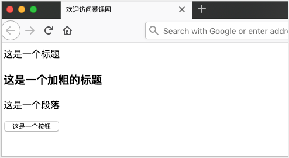
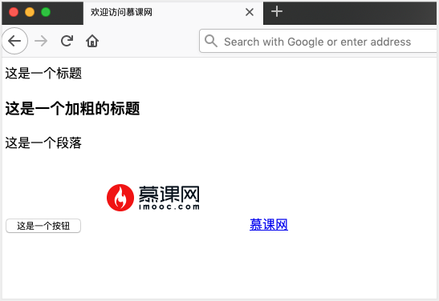
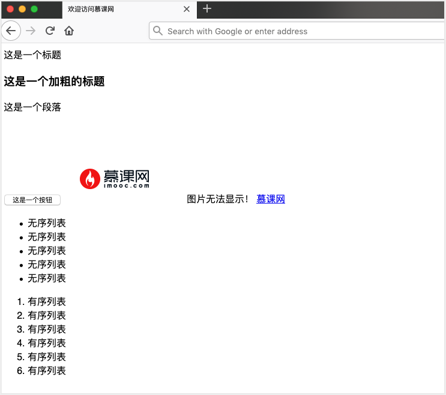
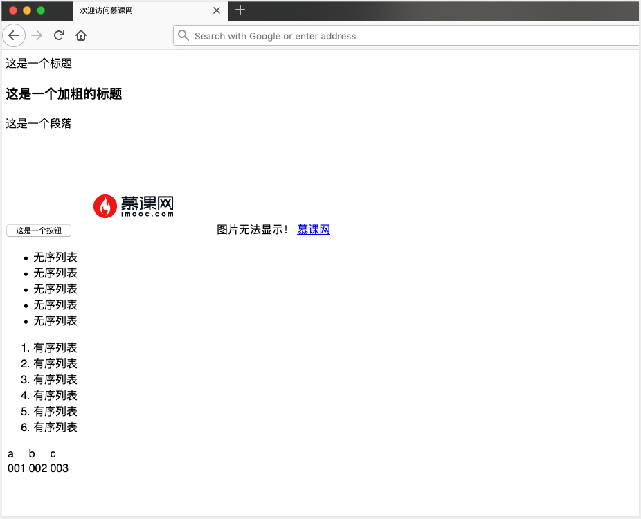
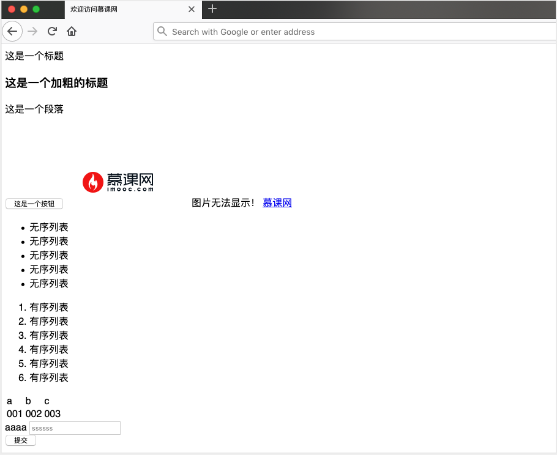
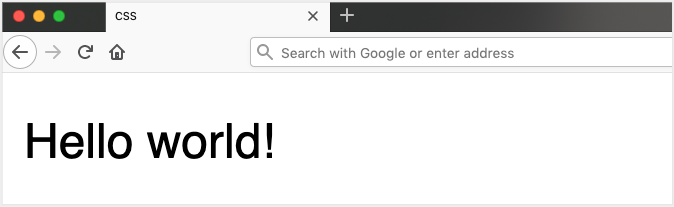
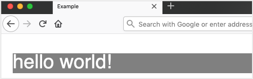
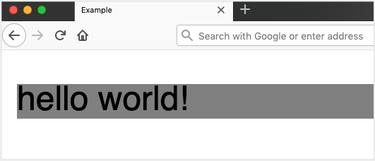
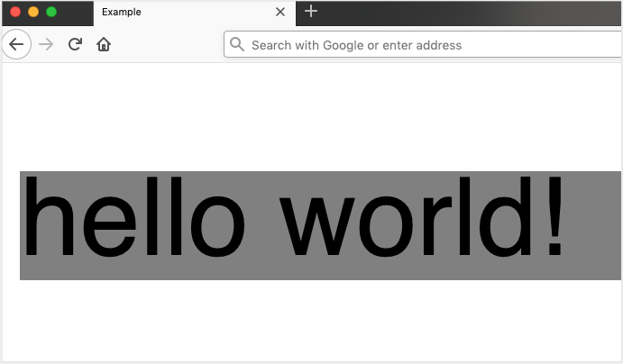
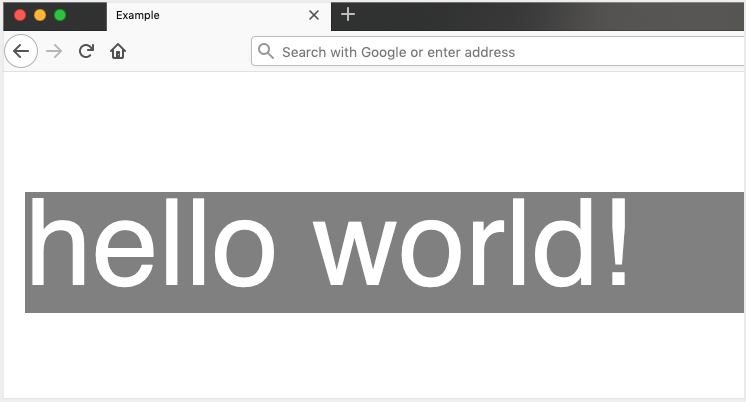

# HTML 与 CSS 基础入门

正所谓，知己知彼，百战不殆。我们爬虫的爬取对象，就是各式各样的网页，只有对网页的基本内容达到熟悉的程度，才能顺利的书写我们的爬虫程序。


## 1. HTML 基础

- HTML（HyperText Markup Language）是一种超文本标记语言；
- CSS（Cascading Style Sheets）简称为层叠样式表。

大家如果只是看这两个名字的定义，估计仍然是一头雾水。这俩东西到底是干啥的？

我给大家举一个例子就明白了，大家应该都画过画吧，即使没有亲自画过应该也见过。毕竟吃猪肉和见猪跑你总得占一样吧。

在画画的时候，我们首先会拿画笔勾勒出图形的样式骨架，之后会涂上一些好看的颜色让画变的更美观。我们写网页的时候也是一样的道理，HTML 就相当于画笔，用于勾勒页面的骨架。CSS 则是好看的颜色，让页面的样式更加美观。

下面我们来认识一下页面的骨架 HTML：

> **Tips：** 可以新建一个 txt 文件，将下面的代码复制进去，然后将文件的后缀名改为 .html ，然后使用浏览器打开就可以看到效果：

**HTML 的标题**

```html
<!DOCTYPE html>  
<html>  
  
<head>  
	 <title>欢迎访问慕课网</title>  
<head>  
	  
	 <body>  
	  
		 <h>这是一个标题</h>  
		 <h3>  
		 <bold>这是一个加粗的标题</bold>  
		 </h3>  
		  
		 <!-- 段落 -->  
		 <P>这是一个段落</P>   
		 <button>这是一个按钮</button>  
	 </body>  
  
</html>
```

效果如下图所示：



**HTML 中添加图片**

```html
<!DOCTYPE html>
<html>

<head>
    <title>欢迎访问慕课网</title>
    <head>

        <body>

            <h>这是一个标题</h>
            <h3>
                <bold>这是一个加粗的标题</bold>
            </h3>

            <!-- 段落 -->
            <P>这是一个段落</P>
            <button>这是一个按钮</button>


            <!-- 下面是慕课网图片 -->
            
            <!-- 超链接 -->
            <a href="https://www.imooc.com/">慕课网</a>
        </body>

</html>
```

效果如下图所示：



**有序列表和无序列表**

```html
<!DOCTYPE html>
<html>

<head>
    <title>欢迎访问慕课网</title>
    <head>

        <body>

            <h>这是一个标题</h>
            <h3>
                <bold>这是一个加粗的标题</bold>
            </h3>

            <!-- 段落 -->
            <P>这是一个段落</P>

            <br>
            <br>
            <br>

            <button>这是一个按钮</button>
            <!-- 下面是慕课网图片 -->
            
            

            <!-- 属性 href -->
            <a href="https://www.imooc.com/">慕课网</a>
            <!-- 列表 -->
            <ul>
                <li>无序列表</li>
                <li>无序列表</li>
                <li>无序列表</li>
                <li>无序列表</li>
                <li>无序列表</li>
            </ul>
            <ol>
                <li>有序列表</li>
                <li>有序列表</li>
                <li>有序列表</li>
                <li>有序列表</li>
                <li>有序列表</li>
                <li>有序列表</li>
            </ol>
        </body>

</html>
```

效果如下图所示：



**表格**

```html
<!DOCTYPE html>
<html>

<head>
    <title>欢迎访问慕课网</title>
    <head>

        <body>

            <h>这是一个标题</h>
            <h3>
                <bold>这是一个加粗的标题</bold>
            </h3>

            <!-- 段落 -->
            <P>这是一个段落</P>

            <br>
            <br>
            <br>

            <button>这是一个按钮</button>
            <!-- 下面是慕课网图片 -->
            
            

            <!-- 属性 href -->
            <a href="https://www.imooc.com/">慕课网</a>
            <!-- 列表 -->
            <ul>
                <li>无序列表</li>
                <li>无序列表</li>
                <li>无序列表</li>
                <li>无序列表</li>
                <li>无序列表</li>
            </ul>
            <ol>
                <li>有序列表</li>
                <li>有序列表</li>
                <li>有序列表</li>
                <li>有序列表</li>
                <li>有序列表</li>
                <li>有序列表</li>
            </ol>


            <!-- 表格 -->
            <table>
                <thead>
                    <tr>
                        <td>a</td>
                        <td>b</td>
                        <td>c</td>
                    </tr>
                </thead>
                <tbody>
                    <tr>
                        <td>001</td>
                        <td>002</td>
                        <td>003</td>
                    </tr>
                </tbody>

            </table>
        </body>

</html>
```

效果如下图所示：



**表单**

```html
<!DOCTYPE html>
<html>

<head>
    <title>欢迎访问慕课网</title>
    <head>

        <body>

            <h>这是一个标题</h>
            <h3>
                <bold>这是一个加粗的标题</bold>
            </h3>

            <!-- 段落 -->
            <P>这是一个段落</P>

            <br>
            <br>
            <br>

            <button>这是一个按钮</button>
            <!-- 下面是慕课网图片 -->
            
            

            <!-- 属性 href -->
            <a href="https://www.imooc.com/">慕课网</a>
            <!-- 列表 -->
            <ul>
                <li>无序列表</li>
                <li>无序列表</li>
                <li>无序列表</li>
                <li>无序列表</li>
                <li>无序列表</li>
            </ul>
            <ol>
                <li>有序列表</li>
                <li>有序列表</li>
                <li>有序列表</li>
                <li>有序列表</li>
                <li>有序列表</li>
                <li>有序列表</li>
            </ol>


            <!-- 表格 -->
            <table>
                <thead>
                    <tr>
                        <td>a</td>
                        <td>b</td>
                        <td>c</td>
                    </tr>
                </thead>
                <tbody>
                    <tr>
                        <td>001</td>
                        <td>002</td>
                        <td>003</td>
                    </tr>
                </tbody>

            </table>

            <!-- 表单 -->
            <form>
                <div>
                    <label>aaaa</label>
                    <input type="text" name="ssss" placeholder="ssssss">
                </div>
                <input type="submit" name="submit" value="提交">
            </form>
        </body>

</html>                                                                   
```

网页显示结果如下：
 


## 2. CSS 基础

我们知道 CSS 是负责页面的样式，让页面更加的美观，那么 CSS 到底是如何让页面更加的美观呢，我们一起来看一下：

首先，我会给大家一个没有添加任何样式的 HTML，然后，我们一步一步的添加不同的样式来展示层叠样式表的效果。

首先，我们需要给 HTML 添加样式，但是，HMTL 有那么多标签，怎么给指定的标签或者一组标签更改样式那。这就引入了选择器的概念。通过选择器我们可以定位到 HTML 里的任何一个元素。

```html
<!DOCTYPE HTML>
<html>
<head>
<title>CSS</title>

</head>
<body>
<p>Hello world!</p>
</body>
</html>
```

可以看到页面中只有 Hello world！这样的文本，并没有任何样式，如下图所示。下面我们就来给 Hello world！增加一些样式。



**使用选择器选择 p 标签**

```html
<!DOCTYPE HTML>
<html>
<head>
<title>Example</title>
<style type="text/css">
p {
   background: grey; //增加灰色背景
   color:white;     //改变字体颜色为白色
   font-size:  10pt;  //设置字体大小为10pt
} //使用选择器选择p标签

</style>
</head>
<body>
<p>hello world!</p>
</body>
</html>
```

我们通过选择器选择了 P 标签，然后给这个标签增加了灰色背景，字体为蓝色，字体大小为 10pt。

效果如下图：
 

**背景**

```html
<!DOCTYPE HTML>
<html>
<head>
<title>Example</title>
<style type="text/css">
p {
    background: grey; //添加灰色到背景颜色
}
</style>
</head>
<body>
<p>hello world!</p>
</body>
</html>
```

效果如下：



**字体**

```html
<!DOCTYPE HTML>
<html>
<head>
<title>Example</title>
<style type="text/css">
p {
    background: grey;
    font-size:  30pt; //调大字体到30pt
}
</style>
</head>
<body>
<p>hello world!</p>
</body>
</html>
```

效果如下所示：



**颜色**

```html
<!DOCTYPE HTML>
<html>
	<head>
		<title>Example</title>
	</head>
	<body>
	</body>
</html>
```

最终效果，如下图所示：



> **Tips**：CSS，其实有很多内容。我只是列出了最常用的五个部分来讲，这些内容其实基本涵盖了我们几乎所有的爬虫课所需要的知识。其他的更多高级内容，请大家移步到慕课网的相关内容进行学习。


## 3. 小结

这一个小节，我们通过几个小例子，熟悉了 Html 和 CSS 的基本使用。读者朋友们可以按照上述步骤，在自己的本机进行练习，来观察页面的样式和字体的变化。

