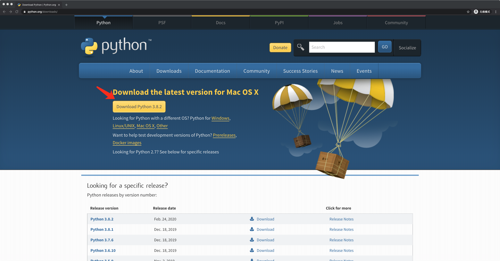
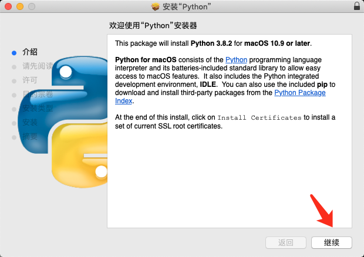
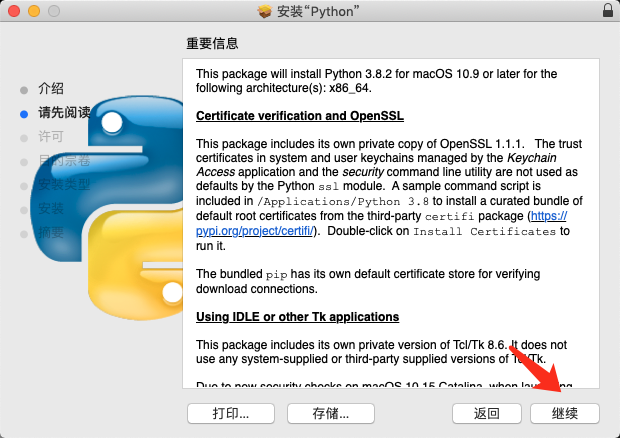
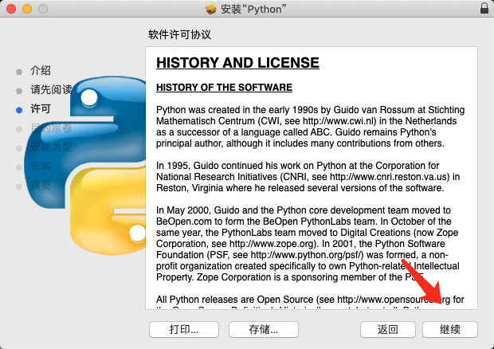
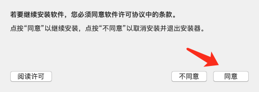
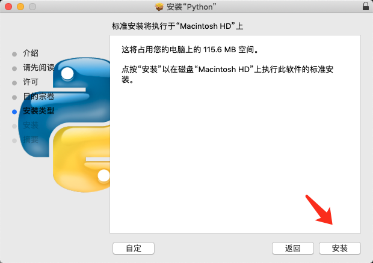
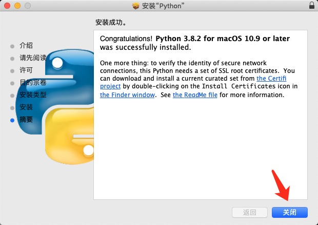
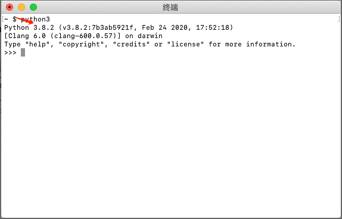
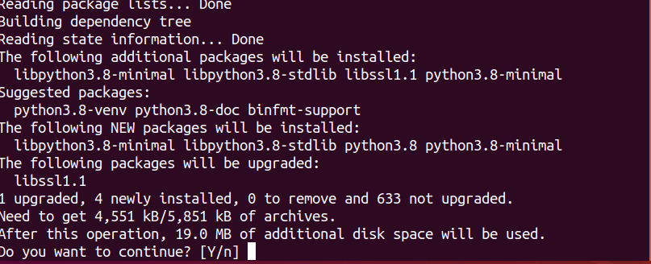
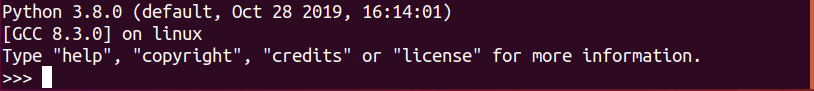

# Python 环境安装

了解了一些 Python 爬虫的基本知识之后，我们要正式开始 Python 爬虫的学习了，因为是要使用 Python 语言来进行爬虫开发，所以首先要在电脑上安装 Python ，那么这节课我们就来学习下在各个不同的操作系统下如何安装 Python。


## 1. Mac 系统的 Python 安装

首先，我们进入 Python 的官方网站，然后点击黄色的按钮，进行下载， 如下图所示：



打开我们已经下载好的文件，在弹出的窗口的右下角，点击继续进行， 如下图所示：



接着点击继续，如下图所示：



接着点击继续，如下图所示：



在弹出的框里面，点击同意，如下图所示：



点击安装，如下图所示：
 

等待大概一分钟左右，点击完毕，完成安装， 如下图所示：



打开 Mac 的终端，输入 python3，查看版本，如果显示为 3.8，则说明安装成功了。



> **Tips**：Windows 下安装 Python 与 Mac 下安装 Python 相同，这里就不多赘述了。


## 2. Linux 下安装 Python

Linux 下安装 Python 比较简单，只需要运行一条命令即可：

```shell
sudo apt-get install python3.8
```

安装过程中，出现如下画面时候，输入 y，点击 enter 即可，如下图所示：



安装成功后，输入 `pyton3.8` ，如果如下图所示，则说明安装成功。




## 3. 小结

这一小节，我们介绍了 Python 环境的安装。在安装完成 Python 之后，我们就可以正式的开启 Python 爬虫之旅了！