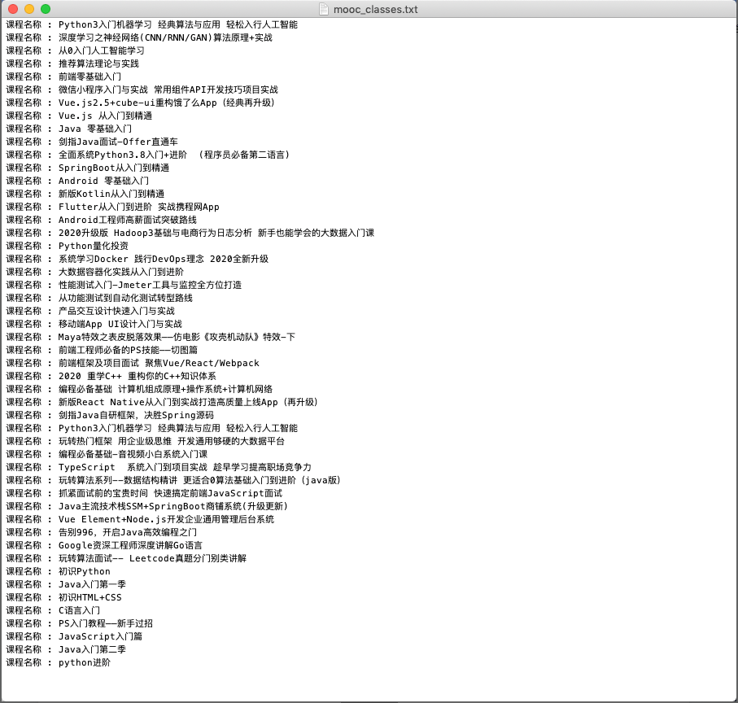

# 最简单的爬虫案例开发

前面的学习中我们已经简单了解了一些爬虫所需的知识，这节课我们就来做一个小爬虫来实践下我们前面所学习的知识，这节课我们会爬取慕课网首页所有的课程名称：


## 1. 爬取慕课网首页所有课程名称

我们第一个爬虫程序，是来爬取慕课网的首页的所有课程信息的名字。下面的代码锁使用到的技术有的我们并没有涉及到，后面的学习中我们会一一讲解。这里只是让大家对爬虫程序有个大概的了解，熟悉最基本的爬虫流程，以及对爬虫处理有一个粗略的印象，同时，也是激发大家学习的热情，让大家对爬虫不仅停留在理论上，也可以实际操作去加深印象。


### 1.1 建立 [imoocSpider.py](http://imoocSpider.py) 文件

爬虫文件的命名一定要准确，爬虫爬取的是哪一个网站就用哪一个网站来进行命名，这样以后我们写的爬虫越来越多会方便管理。

文件创建好之后首先导入 requests 第三方库和页面解析工具 BeautifulSoup：

```python
import requests   # requests库，用来发送网络请求

from bs4 import BeautifulSoup   # 一个解析库，用来解析网页结构
```

> **Tips**：BeautifulSoup 我们在后面会讲到，这里只是先用一下。


### 1.2 定义网址变量

定义网址变量 url，url 中存储的是我们要爬取的网站，这个小爬虫中我们要爬取的网站是：https://www.imooc.com。

```python
url = "https://www.imooc.com" #慕课网首页地址
```


### 1.3 创建请求头部

创建请求头部，因为服务器会分辨请求的是浏览器或者是爬虫，如果是爬虫的话会直接断开请求，导致请求失败。为了不让我们的爬虫暴露，所以要给它加上一层伪装，这样服务器就会认为是浏览器在请求了：

```python
headers = {'User-Agent' : 'Mozilla/5.0 (Macintosh; Intel Mac OS X 10_11_5) AppleWebKit/537.36 (KHTML, like Gecko) Chrome/51.0.2704.79 Safari/537.36'} # 请求头部
```


### 1.4 发起请求

使用 requests 库中的 get 方法来进行请求：

```python
r = requests.get(url, headers= headers) # 发送请求
```


### 1.5 解析请求结果

因为请求的结果是 HTML 格式的，所以我们使用 BeautifulSoup 来解析我们的请求结果：

```python
bs = BeautifulSoup(r.text, "html.parser")   # 解析网页
```

在返回的请求结果中，我们想要的数据都是在 `h3` 标签中包裹着，所以我们使用 BeautifulSoup 查找返回结果中所有的 `h3` 标签并剥离，存储在变量 mooc_classes 中。

```python
mooc_classes = bs.find_all("h3", class_="course-card-name") # 定位课程信息
```


### 1.6 解析数据

将每一个 `h3` 标签中的课程名称剥离，并存储在 `class_list` 这个列表中去，最后将课程信息存入到文本文件中：

```python
class_list = []

for i in range(len(mooc_classes)):
    title = mooc_classes[i].text.strip()
    class_list.append("课程名称 : {} \n".format(title)) #格式化课程信息

with open('mooc_classes.txt', "a+") as f: # 将课程信息写入文本文件中
    for text in class_list:
        f.write(text)
```


### 1.7 最终代码

下面就是我们这个小爬虫的最终代码：


 实例演示

```python
import requests   # requests库，用来发送网络请求

from bs4 import BeautifulSoup   # 这是一个解析库，用来解析网页

url = "https://www.imooc.com" #慕课网首页地址

headers = {'User-Agent' : 'Mozilla/5.0 (Macintosh; Intel Mac OS X 10_11_5) AppleWebKit/537.36 (KHTML, like Gecko) Chrome/51.0.2704.79 Safari/537.36'} # 请求头部

r = requests.get(url, headers= headers) # 发送请求

bs = BeautifulSoup(r.text, "html.parser")   # 解析网页

mooc_classes = bs.find_all("h3", class_="course-card-name") # 定位课程信息

class_list = []

for i in range(len(mooc_classes)):
    title = mooc_classes[i].text.strip()
    class_list.append("课程名称 : {} \n".format(title)) #格式化课程信息

with open('mooc_classes.txt', "a+") as f: # 将课程信息写入文本文件中
    for text in class_list:
        f.write(text)

```

[运行案例](http://www.imooc.com/wiki/run/54.html) 点击 "运行案例" 可查看在线运行效果

上面的程序，就是一个最简单的一个爬虫程序。最后，我们格式化输出的样式，使得输出格式为 **课程名称+慕课网课程名称**的样式，最后把结果保存到一个 TXT 文件里面。最后我们打开 TXT 文件看一下效果：

如下图所示：



> **Tips**：一般在正式的爬虫开发中我们不会把数据存储到文件中去，而是会存储到数据库中，这样才能最大限度的保证数据不会丢失。


## 2. 小结

本小节，通过运用 BeautifulSoup 以及  Requests  实现了一个最简单的爬虫程序，关于它们的学习，我们会在后面的章节进行详细论述。这个小程序，只是向大家演示一个最基本的爬虫的工作流程。细心的同学肯定会发现，我们的代码量并不是很多，就轻松实现了一个简单的爬取工作。其实，正式因为使用Python 编写爬虫程序的简单方便，才使得 Python 语言成为了写爬虫程序的首选。