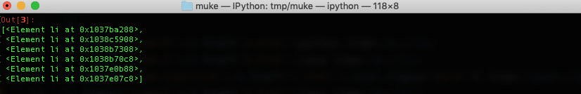
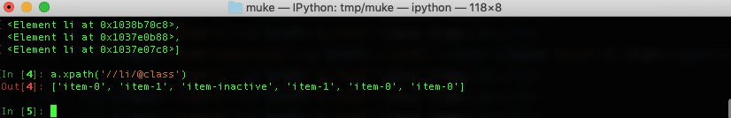
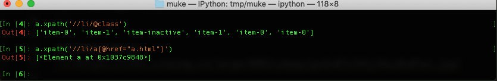

# 使用 Xpath 进行爬虫开发

Xpath( XML Path Language, XML路径语言)，是一种在 XML 数据中查找信息的语言，现在，我们也可以使用它在 HTML 中查找需要的信息。

既然谈到 Xpath 是一门语言，当然它就会有自己的一些特定的语法。我们这里罗列一些经常使用的语法，熟悉下面的基本语法之后，就能满足我们日常的爬虫开发所用。


### 本小节主要内容:

- Xpath的基本概念
- Xpath的基本语法
- Xpath实战


### 学习目标：

熟练掌握常用的 Xpath 的基本操作


## 1. 开发前的准备

前面我们介绍的 XPath 基本的语法和基本操作，下面我们通过 lxml 库，来熟悉一下 XPath 的使用。

首先，我们需要一个测试文件，文件如下，文件名为 xpath_test.xml：

```xml
<!---  这是一个测试数据，方便我们后面进行解析-->
<div>
<ul>
<li class='item-0'><a href='a.html'>python item</a></li>
<li class='item-1'><a href='b.html'>java item</a></li>
<li class='item-inactive'><a href='c.html'><span class='bold'>C item</span></a></li>
<li class='item-1'><a href='d.html'>java item</a></li>
<li class='item-0'><a href='b.html'>java item</a></li>
<li class='item-0'><a href='b.html'>java item</a></li>
</ul>
</div>
```


## 2. 基本语法


### 2.1 节点之间的关系

- **父节点**：每个元素都有一个父亲节点；
- **子节点**：每个元素节点可以有零个，一个或者多子节点；
- **兄弟节点**：拥有相同父亲节点的节点；
- **先辈节点**：一个元素的父亲节点的父亲节点；
- **后辈节点**：一个元素的子节点的子节点。

**表达式基本语法**

| 表达式      | 功能简介                                                   |
| ----------- | ---------------------------------------------------------- |
| node        | 选取node下面的所有的节点                                   |
| /node       | 斜杠是代表绝对路径，这个表达式语法的意思就是选择根上的node |
| //node      | 选择所有的node的节点，与XML的位置无关                      |
| .           | 选择当前节点                                               |
| …           | 选择当前节点的父亲节点                                     |
| node/child  | 选取node子节点的所有的child元素                            |
| node//child | 选取所有后备节点的chiid信息                                |
| //@href     | 选取所有的href的属性                                       |


### 2.2 谓语与通配符

| 表达式                       | 功能简介                            |
| ---------------------------- | ----------------------------------- |
| /books/python[1]             | 选取books子元素中的第一个python元素 |
| /books/python[last()]        | 选取books子元素中的最后一个元素     |
| /books/python[position()<10] | 选取books子元素的前9个元素          |
| .                            | 选择当前节点                        |
| …                            | 选择当前节点的父亲节点              |
| node/child                   | 选取node子节点的所有的child元素     |
| node//child                  | 选取所有后备节点的chiid信息         |
| //@href                      | 选取所有的href的属性                |


## 3. 开发案例

**开发案例一：**

- 从xml中查找出所有的’li’标签

```python
from lxml import etree
emt = etree.parse('text.xml')
rst = emt.xpath('//li')
```

运行结果如下图所示：
 

**开发案例二：**

- 从xml中查找出所有的’li’标签的所有class

```python
from lxml import etree
emt = etree.parse('text.xml')
rst = emt.xpath('//li/@class')
```

运行结果如下图所示：
 

**开发案例三：**

- 从xml中查找出所有的’li’标签下面的href为a.html的标签

```python
from lxml import etree
emt = etree.parse('text.xml')
rst = emt.xpath('//li/a[@href="a.html"]')
```

运行结果如下图所示：
 


## 4. 小结

XPath 是一种查询语言，它是通过路径来寻找相应的信息，正如它的英文名称 path 一样，通过不同种X路径，最终找到自己需要的信息。通过 XPath,我们不但可以搜索 XML，也可以搜索 HTML。

通过案例，我们基本熟悉了 XPath 的基本使用，这也为我们后面学习 BeautifulSoup 打下了良好的基础，XPath 为我们从复杂的文档中，快速定位信息提供了良好的支持，也为我们后面处理和整理爬虫爬下来的信息奠定了根基。